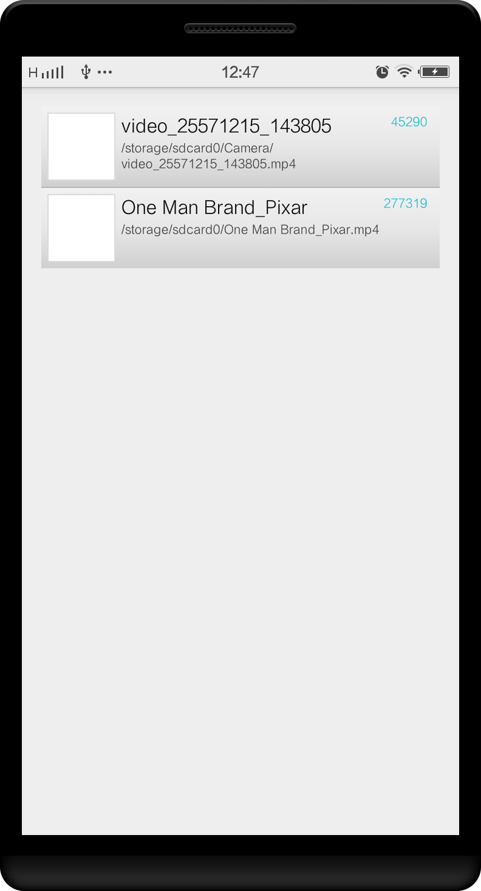
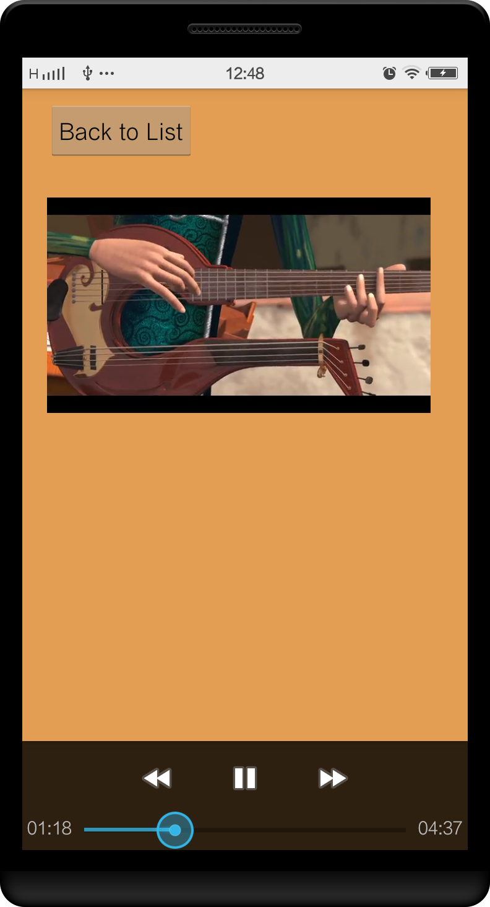

#MyVideoPlayer
##Introduction has only two activity, one is to show the list, then ohter is show the playing video.
- MainActivity: 重写了adapter，并读取数据库，写入视频信息到列表
- PlayVideo: 简单的实现了播放界面

##Notes
###参考学习
- [recyclereview-playround](https://github.com/devunwired/recyclerview-playground) StaggeredGridView用法实例的github项目
- [提供RecycleView封装的api](http://lucasr.org/2014/07/31/the-new-twowayview/)
- [android官方文档 StaggeredGridLayoutManager](http://developer.android.com/reference/android/support/v7/widget/StaggeredGridLayoutManager.html#)

###How to getThumbnail of a Video

##### MediaStore.Video.Thumbnails.getThhumbnail( , , MediaStore.Video.Thumbnails.MICRO_KIND,)
```
Bitmap thumbBitmap = MediaStore.Video.Thumbnails.getThumbnail(mContext.getContentResolver(),
            item.videoId,
            MediaStore.Video.Thumbnails.MICRO_KIND,
            (BitmapFactory.Options)null);
```
Thumbnails widht and height is 96*96

##### MediaStore.Video.Thumbnails.getThhumbnail( , , MediaStore.Video.Thumbnails.MINI_KIND,)
```
BitmapFactory.Options options = new BitmapFactory.Options();
        options.outHeight = mThumbnailParentWidth;
        options.outWidth = mThumbnailParentWidth;
Bitmap thumbBitmap = MediaStore.Video.Thumbnails.getThumbnail(mContext.getContentResolver(),
            item.videoId,
            MediaStore.Video.Thumbnails.MINI_KIND,
            options);
```
Thumbnails widht and height is 288*512

options is for decoding MINI_KIND, so it will not be usefull if options.outWidth is not fit for MINI_KIND

#####ThumbnailUtils.createVideoThumbnail####

[References](http://www.jianshu.com/p/4aa82a21b4b5)

#####MediaMetadataRetriver####

[MediaMetadataRetriver.getFrameAt](http://developer.android.com/intl/zh-cn/reference/android/media/MediaMetadataRetriever.html#getFrameAtTime)

[MediaMetadataRetriver与ThumbnailtUtils.createVideoThumbnail的关系](http://m.blog.csdn.net/blog/Mr_dsw/48524977), 可以查看源码

###RecyclerView don't has onItemClickListener
RecyclerView don't has onItemClickLister&& onItemLongClickListern, so you have to implement them.
[参考](http://stackoverflow.com/questions/24471109/recyclerview-onclick/26826692#26826692)

###AsyncTask加载列表缩略图
http://developer.android.com/intl/zh-cn/training/displaying-bitmaps/process-bitmap.html
http://developer.android.com/intl/zh-cn/training/displaying-bitmaps/process-bitmap.html
http://developer.android.com/intl/zh-cn/training/displaying-bitmaps/display-bitmap.html

###获取更清晰额缩略图并缓存在cache中
- 使用MediaMetadataRetriever.getFrameAtTime()获取缩略图, 如果获取失败是MediaStore.Video.Thumbnails.getThumbnail()获取
- 获取的缩略图缓存在externalCacheDir()中, 通过id和progres命名

###DoubleMovieActivity
两个播放窗口, 但是没有播放声音
[参考](https://github.com/google/grafika/blob/master/src/com/android/grafika/DoubleDecodeActivity.java)

###MediaPlayer
http://developer.android.com/intl/zh-cn/reference/android/media/MediaPlayer.html
http://developer.android.com/intl/zh-cn/guide/topics/media/mediaplayer.html

###SurfaceView&&VideoView
VideoView extends SurfaceView

http://developer.android.com/reference/android/view/SurfaceView.html
http://developer.android.com/reference/android/widget/VideoView.html#getAudioSessionId()
http://stackoverflow.com/questions/16700587/how-to-attach-mediaplayer-with-surfaceview-in-android
http://stackoverflow.com/questions/16700587/how-to-attach-mediaplayer-with-surfaceview-in-android

###GalleryView
https://github.com/inovex/ViewPager3D
http://blog.csdn.net/pzhtpf/article/details/7251579
https://github.com/sourcey/imagegallerydemo

##Todo
- [+] StaggedGridView
- [+] thumbnail.scale
- [+] Item display
- [+] AsyncTask加载缩略图, scroom the list smoothly
- [+] 优化1: 把获取的缩略图存储起来
- [+] DoubleViewActivity
- [ ] 删除动画
- [ ] ViewStub覆盖住主界面, 没有视频的时候
- [ ] ActionBar重写
- [ ] ActionBar图标
- [ ] App图标
- [+] 播放界面, with SurfaceView
- [ ] 播放界面的操作: 快进, 快退, 播放
- [ ] 响应Touch事件
- [ ] 最后播放的视频特殊化
- [ ] 缩略图使用最后退出时一帧的图片, AsyncTask实现
- [ ] 悬浮播放窗
- [ ] SearchView的实现
- [ ] CheckBox的实现
- [ ] DoubleViewActivity优化: 添加声音, 控制
- [ ] 类似搜狐视频一样的截屏进度条

##图片介绍


